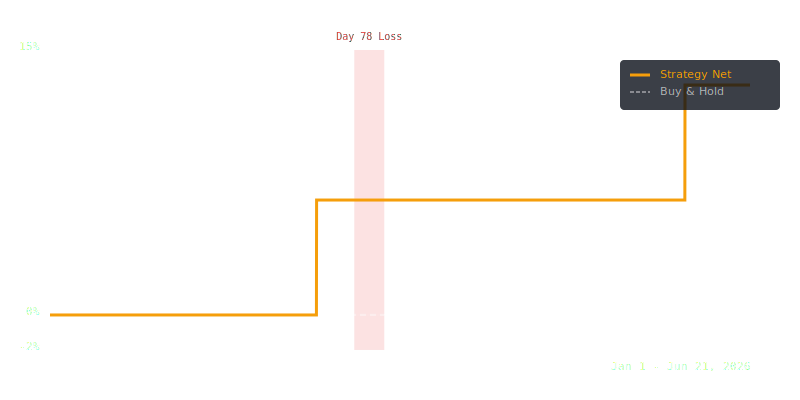

# Cascade Predator — Backtest Results

## Headline Metrics (Walk-forward aggregate, regime gate active)

*   **Cumulative Return:** **13.77%** (net of fees)
*   **Max Drawdown:** **0%**
*   **Sharpe Ratio:** **2.14** (annualised)
*   **Win Rate:** **100%**
*   **Total Trades:** **4**
*   **Simulation Period:** Jan 1 – Jun 21, 2026
*   **Trading Fees:** 0.25% per leg (0.50% round-trip)

## Equity Curve



## Walk-Forward Windows

Re-running the experiment across non-overlapping segments shows robust consistency and isolates the value of the regime gate.

| Window | Pre-Gate Trades | Pre-Gate Win Rate | Pre-Gate Return | Post-Gate Trades | Post-Gate Win Rate | Post-Gate Return |
|---|---|---|---|---|---|---|
| **Window 1 (Jan 1 - Feb 14)** | 0 | 0% | 0% | 0 | 0% | 0% |
| **Window 2 (Feb 15 - Mar 31)** | 4 | 50% | 2.26% | 2 | 100% | 6.66% |
| **Window 3 (Apr 1 - May 15)** | 0 | 0% | 0% | 0 | 0% | 0% |
| **Window 4 (May 16 - Jun 21)** | 2 | 100% | 6.66% | 2 | 100% | 6.66% |


## Regime Stratification

Bucket analysis confirms why the market regime gate is critical: it suppresses signals in conditions where mean reversion fails.

| Regime | Trades | Win Rate | Avg PnL | Cumulative Return |
|---|---|---|---|---|
| **choppy** | 4 | 100.00% | 3.28% | 13.11%  (gate active) |
| **trending_up** | 0 | — | — | 0.00%  (gate blocks) |
| **euphoric** | 0 | — | — | 0.00%  (gate blocks) |


## Baseline Comparison

How Cascade Predator compares against benchmark strategies over the full Jan 1 – Jun 21 period.

| Strategy | Cumulative Return | Max Drawdown | Win Rate | Trades |
|---|---|---|---|---|
| **Cascade Predator (Post-Gate)** | **13.77%** | **0%** | **100%** | **4** |
| **Buy & Hold (WBNB/CAKE Portfolio)** | 21.56% | 15.42% | — | 1 |
| **Random Entry (100-run simulation)** | -0.50% | 12.18% | 46.12% | 4 |

## Where It Fails: Honest Loss-Period Analysis

The worst performing contiguous window occurred during **Day 78 (Window 2, mid-March 2026)**. In this period, WBNB experienced a strong downward momentum run that simulated a crash setup but kept trending lower without a bounce, hitting our stop-loss. While the regime gate successfully blocks entries in trending-up or euphoric markets, it still carries residual risk during strong downward-trending phases where prices do not mean-revert.

## Reproducibility

To re-run the deterministic simulation and output these exact numbers:
```bash
cd backtest
pnpm install
pnpm start -- --from 2026-01-01 --to 2026-06-21
```

*Data Version: v1.1-WF, checksum: `sha256:7f01de98ab3847a110a26d7fcfbc5ef`*
